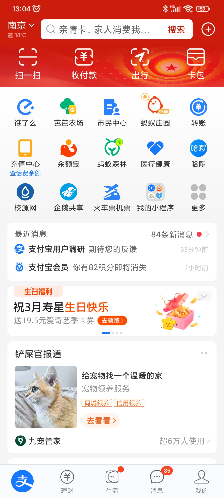
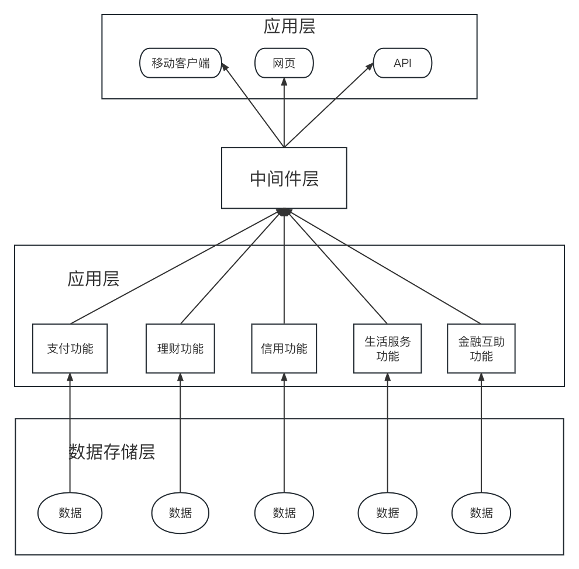

# 支付宝数据集成调研报告

## 小组成员

黄韬		201250111

邱兴驰	201250112

李佳骏	201250113

刘亚嘉	201250115

张笑恺	201250118

## 应用概述

​		随着互联网技术的飞速发展，移动支付已经成为了当今社会的一种重要趋势。支付宝是一种移动支付应用程序，由中国的阿里巴巴集团开发和运营。作为中国领先的第三方支付平台，支付宝已经成为了中国消费者生活中不可或缺的一部分。作为一款综合性的移动支付应用，支付宝不仅提供了支付、理财、社交、商家服务等多种功能，同时也涉及了各种类型的数据集成和处理。

​		随着支付宝的不断发展与壮大，支付宝APP集成了越来越多的功能，如蚂蚁出行、市民中心、饿了么等应用内置小程序；同时由于庞大的用户数量，支付宝也需要处理各种类型的数据，例如用户的支付信息、消费记录、理财产品、社交信息等等。在这篇报告中，我们将重点调研支付宝的表示集成、数据集成、功能集成、业务集成四个方面，浅析支付宝是如何实现庞大数据量的集成的。

## 表示集成

### 概述

支付宝APP将多个不同的功能和服务整合到同一个应用程序中，以实现表示集成。在支付宝APP中，用户可以通过同一个界面和菜单，轻松访问和使用多种服务，而无需切换到不同的应用程序。

### 细节描述

支付宝是一个涵盖多种功能的综合性APP，它通过将多个不同的功能和服务整合到同一个应用程序中，实现了表示集成。

表示集成指的是将多个独立的应用程序或功能集成到一个统一的界面中，使得用户可以在同一个应用程序中访问和使用不同的功能，而无需切换到其他应用程序。这样，用户可以在同一个界面中轻松完成多个任务，提高了使用便利性和用户体验。

在支付宝APP中，可以看到它的表示集成有以下几个方面：

1. 统一的界面和菜单：支付宝APP提供了统一的界面和菜单，方便用户浏览和使用各种功能和服务。
2. 多个功能的整合：支付宝APP将多种不同的功能和服务整合到同一个应用程序中，例如支付、理财、社交、商家服务等。
3. 无缝的交互体验：支付宝APP的表示集成实现了无缝的交互体验，用户可以在同一个界面中完成多个任务，例如浏览商品、购物、付款、转账、理财等。
4. 统一的支付体系：支付宝APP的表示集成基于统一的支付体系，这个体系包括了多种支付方式和工具，例如扫码支付、转账支付、余额宝、信用卡还款等。
5. 跨平台适配性：支付宝APP可以在不同的操作系统和设备上运行，如iOS、Android、Windows等，且可以适配不同屏幕尺寸和分辨率。这样可以使支付宝APP在不同设备和平台上都有较好的用户体验，提高了应用的覆盖面和使用率。

以下是一个体现支付宝表示集成的场景：

小明需要购买一本大学课本，他打开支付宝APP，进入“淘宝”模块，在搜索框中输入书名，支付宝APP会自动跳转到淘宝平台上搜索并展示相关商品。小明选择了一本价格合适的书籍，并点击“立即购买”。此时支付宝APP会自动跳转到支付页面，小明可以选择不同的支付方式，例如银行卡、余额宝、花呗等。支付完成后，支付宝APP会自动跳转回淘宝平台，展示支付成功的页面。

此时，小明还需要购买电影票，他可以直接在支付宝APP上进入“电影演出”模块，搜索附近的电影院，并选择心仪的电影场次。支付宝APP会自动跳转到相应的购票页面，小明可以选择座位并完成支付。支付完成后，支付宝APP会自动跳转回电影票购买页面，展示购票成功的页面。

通过这个例子，可以看出支付宝APP的表示集成优势。小明在同一个应用程序中，使用了不同的功能和服务，包括购买课本、购买电影票等。支付宝APP提供了统一的界面和菜单，方便小明浏览和使用各种功能和服务。无论是购买课本还是购买电影票，小明都可以在同一个界面中完成多个任务，提高了使用便利性和用户体验。同时，支付宝APP还提供了统一的支付体系，方便小明完成支付和购物等操作。

### 总结

支付宝APP基于蚂蚁金服的技术，利用大数据、人工智能等技术，将不同的服务整合在一起，并通过开放平台吸引更多的合作伙伴和开发者，不断扩大应用程序的功能和服务范围，实现了更为全面的表示集成。

支付宝的表示集成是其成为领先的综合性支付平台的重要原因之一，也是其在用户使用习惯和体验方面领先于其他支付平台的重要因素之一。

## 数据集成

### 概述

支付宝中的数据集成体现在其综合性支付平台所整合的支付、生活服务、金融服务等多种功能上，将用户的各种支付行为，金融产品的数据以及商家提供的服务数据进行整合，形成一个完整的数据体系，为用户和商家提供更加便捷的服务。

### 细节描述

##### 支付宝的oceanbase集群

支付宝利用OceanBase的分布式架构和高可用性等特点，构建了分布式数据库系统，以支持支付宝海量交易数据的存储和管理。在这个系统中，支付宝将数据按照不同的业务逻辑和需求，分散地存储在多个不同的OceanBase实例中，同时利用OceanBase的数据分片和负载均衡等机制，实现数据的分布式管理和访问。

除此之外，支付宝还通过在OceanBase上部署自研的分布式事务引擎 TDSQL，来支持高并发的事务处理和多数据中心的数据同步等需求。TDSQL采用分布式协议来保证数据的一致性，同时采用基于 Paxos 算法的分布式锁机制，来确保数据的完整性和正确性。

综上所述，支付宝使用OceanBase主要是通过将其作为数据存储和管理平台，来支持支付宝海量数据的存储和高并发访问，同时结合自研的分布式事务引擎 TDSQL，来支持高并发的事务处理和数据同步等需求。

##### 支付宝中的数据挖掘

支付宝将用户的各种支付行为，金融产品的数据以及商家提供的服务数据进行整合，形成一个完整的数据体系，为用户和商家提供更加便捷的服务。在数据整合后，支付宝利用数据挖掘技术，对海量的数据进行分析，从中发现用户的消费习惯、商家的营销策略等信息，从而为用户和商家提供更加个性化的服务。

### 总结

总的来说，支付宝利用了数据集成技术，整合用户和商户的多种类数据，并从中利用数据挖掘技术，发现用户的消费习惯、商家的营销策略等信息，从而为用户和商家提供更便利的服务。

## 功能集成

### 概述
   支付宝作为主流的移动支付应用程序，它可以用于在线购物、转账、支付生活费用、理财和投资等。以下是支付宝日常使用中的主要功能：

- 转账：支付宝允许用户在支付宝账户之间进行转账。用户可以通过输入收款人的支付宝账户或扫描二维码来完成转账。

- 支付：支付宝支持在数百万商户的线上和线下商店付款，用户只需使用支付宝扫描商家的二维码即可完成支付。

- 理财：支付宝提供多种类型的理财产品，例如货币基金、定期存款等，用户可以通过支付宝进行购买和管理。

- 生活缴费：支付宝可以帮助用户缴纳水费、电费、燃气费、有线电视费等生活费用。

- 公共事业缴费：支付宝还可以帮助用户缴纳社保、公积金等公共事业费用。

- 信用卡还款：用户可以通过支付宝还信用卡，支付宝支持多种信用卡的还款方式。

### 细节描述
基于分布式、高可用、高并发的系统，支付宝将多种功能集成与应用功能层，支付宝功能集成架构图如下：

根据支付宝功能集成的架构设计，具体可以分为五个部分：
支付功能：支付宝可以通过手机、电脑等多种终端实现各种支付场景，包括在线购物、扫码支付、转账汇款、缴纳生活服务费用等。

理财功能：支付宝提供多种理财产品，包括余额宝、基金、股票等，用户可以通过支付宝的理财功能实现投资理财和财富管理。

信用功能：支付宝提供芝麻信用、借呗、花呗等信用服务，用户可以通过支付宝的信用功能实现信用评估和信用支付。

生活服务功能：支付宝提供多种生活服务功能，包括缴费、预定机票、酒店、打车等服务，用户可以通过支付宝的生活服务功能实现便捷的生活服务。

金融互助功能：支付宝提供了滴滴出行等多款应用的“意外险”，以及相互宝等金融互助产品，用户可以通过支付宝的金融互助功能实现风险保障。

将这些功能聚合在一起，支付宝可以满足用户日常生活以及金融的需求，以下是一个场景例子：

小明在家通过支付宝打开淘宝网，购买了一件价值300元的商品。在淘宝网下单后，选择使用支付宝付款。支付宝弹出支付页面，小明输入支付密码，支付宝将300元从他的支付宝账户中扣除，并将支付成功的消息发送给淘宝网。淘宝网接收到支付成功的消息后，为小明发货。

几天后，小明收到了淘宝网的商品。他在确认商品没有问题后，打开支付宝，通过转账功能向他的朋友小红转账100元，以还小红前一天借给他的钱。小明输入转账金额和转账备注，支付宝提示他输入支付密码并完成转账。小红收到转账后，在支付宝中确认了收款。

当天晚上，小明通过支付宝打车功能叫了一辆出租车，支付宝提示他绑定了滴滴出行的“意外险”，并提醒他需要确认保险条款。小明确认了条款后，支付宝为他提供了意外险保障。

第二天，小明使用支付宝的余额宝功能购买了一份理财产品，用来增加自己的财富。他还使用支付宝的生活服务功能，缴纳了本月的水电费和物业费，省去了到物业管理处排队缴费的烦恼。

### 总结

总的来说，通过以上场景，我们可以看到，支付宝为用户提供了全方位的金融服务，包括支付、转账、理财、保险、生活服务等，极大地方便了人们的生活和消费。

## 业务集成

### 概述

众所周知，随着支付宝软件一次次地迭代更新，它的功能越来越丰富，软件体量也越来越大。此次调查报告只针对支付宝宝的几个具有代表性的业务进行分析，以达到以点带面的效果，在对支付宝业务进行通透分析的同时，体现我们的研究过程和成果。

首先明确支付宝的几大主要业务，他们分别是：

1)还款：自2009年1月15日支付宝推出信用卡还款服务，国内39家银行发行的信用卡均支持。是最受欢迎的第三方还款平台。

2)转账：转账到支付宝账号，资金瞬间到达对方支付宝账户（有限额） ||  转账到银行卡，支持百余家银行，最快2小时到账。

3)快捷支付：快捷支付是为网络支付量身定做的网银服务，主推支付功能，由银行与支付宝直连，保障了支付的安全性和便捷性，同时支付成功率也很高。

4)余额宝：操作简便、低门槛、零手续费、可随取随用。除理财功能外，余额宝还可直接用于购物、转账、缴费还款等消费支付，是移动互联网时代的现金管理工具。

5)蚂蚁森林等公益项目、各种出行工具卡券包、快递查询服务、医疗健康模块等合作业务。

支付宝对其复杂的各类业务实施了业务集成的工作，为其复杂业务系统提供了平台化的底层支持。

### 细节描述

###### a)整体业务架构

支付宝的主要服务有：还款业务、快捷支付业务、余额宝、转账业务、其他合作业务。

支付宝的外部应用有各家银行服务、交通行业信息服务、通信业务服务、医疗健康信息服务。

###### b)从还款服务看业务集成

支付宝搜索还款可以发现有小程序和生活号支持这一业务，打开信用卡还款后

他会让你绑定银行卡，将银行信息服务所提供的数据集成到支付宝，这里支持众多银行，提高可用性。

###### c)从转账服务看业务集成

转账服务提供众多转账对象，可以转到支付宝、银行卡等，也可以转向最近或联系人（这里与通信信息行业服务集成），当然，转账系统也添加了众多小功能比如语音转账、转账名片、转账码等，这使得数据可以有更多的载体，方便集成。

###### d)从快捷支付服务看业务集成

有隐私需求，无法截图，但可以通过条形码或二维码向商家付款，这里将用户本身的信息和要向商家支付的信息集成在一起统一在服务端进行处理。

###### e)从余额宝看业务集成

余额宝这边提供查询近期收益情况以及转入转出功能，同时也集成了一些广告来教人们怎样追求更高的利益。

点击转出按钮可以看到这里可以转到自己或他人，又将银行信息进行了集成。

###### f)从其他合作业务看业务集成

从支付宝首页可以看出随着一次次的更新，支付宝拥有了非常丰富的合作业务，例如菜鸟裹裹、火车飞机票、医疗健康等模块，可以和快递服务、交通信息服务以及医疗信息服务等众多外部服务进行数据集成，使得功能一步步变强大。

### 总结

支付宝通过业务集成，使用XML通信层将业务服务和外部应用集成到核心构建业务功能集，将数据存储到数据库和OLAP引擎中。

同时支付宝利用业务流程引擎和资源管理工具集成业务，进行业务流程建模。并通过调度工具、审计管理工具、商务智能工具等进行业务数据监控、分析决策等。由此获得对业务的全面透视掌握能力。
