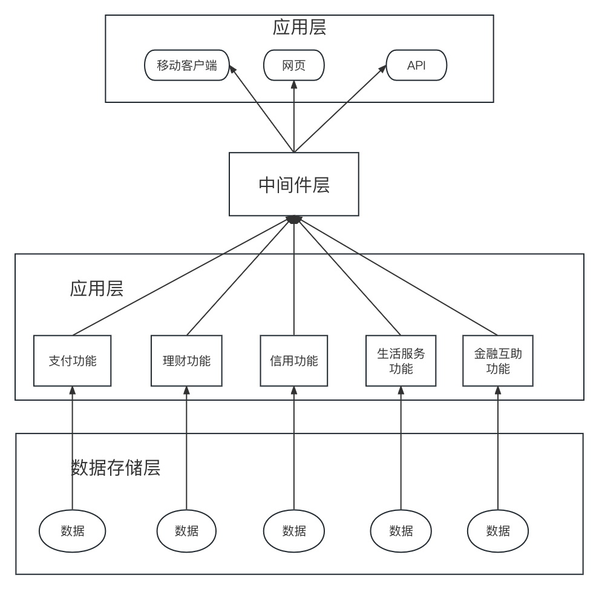

## 功能集成

### 概述
   支付宝作为主流的移动支付应用程序，它可以用于在线购物、转账、支付生活费用、理财和投资等。以下是支付宝日常使用中的主要功能：

- 转账：支付宝允许用户在支付宝账户之间进行转账。用户可以通过输入收款人的支付宝账户或扫描二维码来完成转账。

- 支付：支付宝支持在数百万商户的线上和线下商店付款，用户只需使用支付宝扫描商家的二维码即可完成支付。

- 理财：支付宝提供多种类型的理财产品，例如货币基金、定期存款等，用户可以通过支付宝进行购买和管理。

- 生活缴费：支付宝可以帮助用户缴纳水费、电费、燃气费、有线电视费等生活费用。

- 公共事业缴费：支付宝还可以帮助用户缴纳社保、公积金等公共事业费用。

- 信用卡还款：用户可以通过支付宝还信用卡，支付宝支持多种信用卡的还款方式。

### 细节描述
基于分布式、高可用、高并发的系统，支付宝将多种功能集成与应用功能层，支付宝功能集成架构图如下：

根据支付宝功能集成的架构设计，具体可以分为五个部分：
支付功能：支付宝可以通过手机、电脑等多种终端实现各种支付场景，包括在线购物、扫码支付、转账汇款、缴纳生活服务费用等。

理财功能：支付宝提供多种理财产品，包括余额宝、基金、股票等，用户可以通过支付宝的理财功能实现投资理财和财富管理。

信用功能：支付宝提供芝麻信用、借呗、花呗等信用服务，用户可以通过支付宝的信用功能实现信用评估和信用支付。

生活服务功能：支付宝提供多种生活服务功能，包括缴费、预定机票、酒店、打车等服务，用户可以通过支付宝的生活服务功能实现便捷的生活服务。

金融互助功能：支付宝提供了滴滴出行等多款应用的“意外险”，以及相互宝等金融互助产品，用户可以通过支付宝的金融互助功能实现风险保障。

将这些功能聚合在一起，支付宝可以满足用户日常生活以及金融的需求，以下是一个场景例子：

小明在家通过支付宝打开淘宝网，购买了一件价值300元的商品。在淘宝网下单后，选择使用支付宝付款。支付宝弹出支付页面，小明输入支付密码，支付宝将300元从他的支付宝账户中扣除，并将支付成功的消息发送给淘宝网。淘宝网接收到支付成功的消息后，为小明发货。

几天后，小明收到了淘宝网的商品。他在确认商品没有问题后，打开支付宝，通过转账功能向他的朋友小红转账100元，以还小红前一天借给他的钱。小明输入转账金额和转账备注，支付宝提示他输入支付密码并完成转账。小红收到转账后，在支付宝中确认了收款。

当天晚上，小明通过支付宝打车功能叫了一辆出租车，支付宝提示他绑定了滴滴出行的“意外险”，并提醒他需要确认保险条款。小明确认了条款后，支付宝为他提供了意外险保障。

第二天，小明使用支付宝的余额宝功能购买了一份理财产品，用来增加自己的财富。他还使用支付宝的生活服务功能，缴纳了本月的水电费和物业费，省去了到物业管理处排队缴费的烦恼。

### 总结

总的来说，通过以上场景，我们可以看到，支付宝为用户提供了全方位的金融服务，包括支付、转账、理财、保险、生活服务等，极大地方便了人们的生活和消费。

参考：支付宝钱包系统架构图解（https://developer.aliyun.com/article/856637）